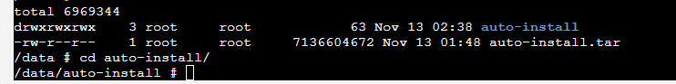
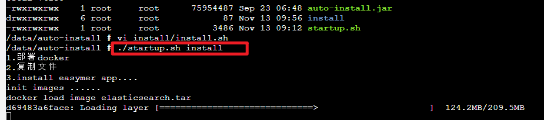

# 命令部署
> 提供命令快速一键部署功能

## 解压部署包

执行解压auto-install.tar.gz  
`tar -zxvf auto-install.tar.gz -C /data`  
优先选择命令行的方式部署速响应用，解压成功之后进入auto-install文件夹   

## 执行部署命令
在auto-install目录下执行:`sh startup.sh install `  
   
执行完该命令之后等待自动部署服务，稍等10分钟，等待出现install success代表部署成功。  
## 验证是否成功
等待2分钟访问8600/nacos登陆进行服务查看是否有服务注册。若nacos访问不了，可以详见4.2进行处理。若在nacos看到2页服务，则可以前往8660/galax门户进行登录，若登录失败，可以详见4.4进行处理。  

!>注：若部署完成之后若想对相关服务进行停止启动操作，可以进入/data/anscen文件夹目录下执行deploy.sh脚本，对相关服务进行操作

 ``可执行deploy.sh start  [jizz|galaxy|mpbd|moon|jizz]启动服务``    
 ``可执行deploy.sh stop  [jizz|galaxy|mpbd|moon|jizz]停止服务``   
 ``可执行deploy.sh rm  [jizz|galaxy|mpbd|moon|jizz]删除服务 ``   
 ``可执行deploy.sh restart [jizz|galaxy|mpbd|moon|jizz]重启服务``  
