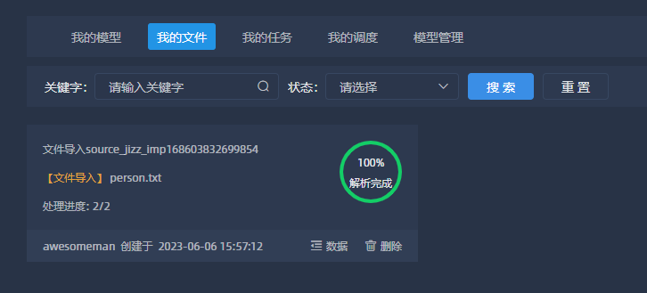

# 部署检查

## 登录星云门户

访问`http://ip:8660/galaxy` 进行登录门户，账号admin/as@123789  
 
 
--- 
 
## 上传数据文件

首先在星云门户上点击极智应用  
   
 进入极智首页之后点击资源中心，新增容器配置以及数据库配置，容器类型选择mysql类型  
  
    
 容器新增成功之后，基于该容器新增节点数据库配置信息  
  
  
  
 新增资源配置结束之后，切换至工作台，选择我的文件，并且上传txt数据文件。  
    
 首先新建一个txt文本文件，输入内容  
    
 上传文件，选择刚创建的容器  
  
    
数据解析完成，数据导入成功，数据导入之后，进行数据模型创建  
    
  
---

## 模型数据创建
  
> 前往我的模型，新增模型 

  
进入极智编辑页，在左侧数据栏中选择 【数据-个人库】，选中刚刚导入的数据。选择【组件】标签中的组件模型对数据进行分析操作，编辑完成之后点击上方的发布模型  
  
这里先简单进行数据模型构建，具体的组件使用可以详细看高级使用中的模型组件使用。这里先选取排序取值进行模型构建  
  
模型构建执行结果  
  
发布模型，使该模型可以被使用  
  

## 查看模型数据

前往探月 【工作台-我的数据 】查看极智服务数据是否存在，若存在，可以点击预览查看数据  
  
## 鹊桥新建服务
> 鹊桥提供服务接口调用能力

前往星云门户点击访问鹊桥服务，进入首页之后点击左侧的资源配置，进行新增资源配置  
  
资源新增之后，进行服务注册  
  
  
注册完服务之后，也需要进行服务发布  

## 查看服务数据

前往探月 【工作台-我的服务 】查看鹊桥服务数据是否存在，若存在，可以点击预览查看数据  

---

## 探月应用绘制

创建好极智模型以及鹊桥服务之后，就可以进行探月的应用绘制了，点击探月应用，点击右侧的前往设计进行新增应用。  

进入探月设计器页面，创建新的空白页面，在左侧的菜单栏中选择组件【数据表格】，拖至页面中，进行数据源选择。  

点击【选择展示数据源】，选择刚刚新建的极智模型或者是鹊桥服务  

点击选择之后数据会显示在页面上，至此极智模型/鹊桥服务已经部署成功  
对应用进行保存之后进行发布，至此整个速响平台部署结束。🎇🎇🎇  

 
  