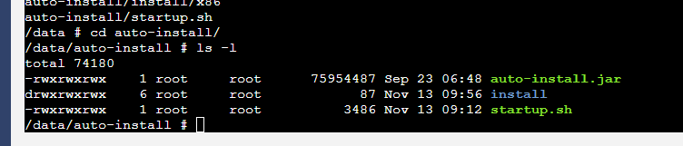
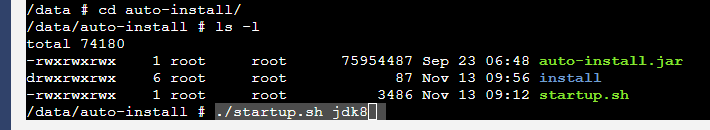
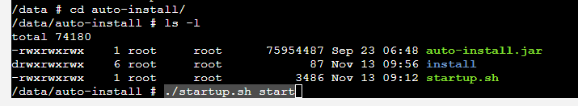
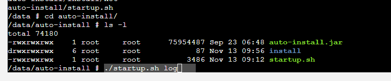
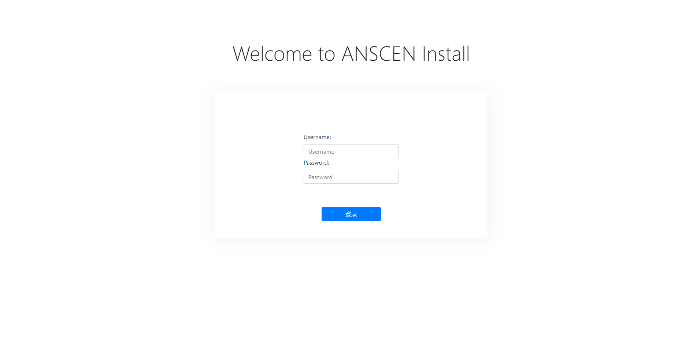
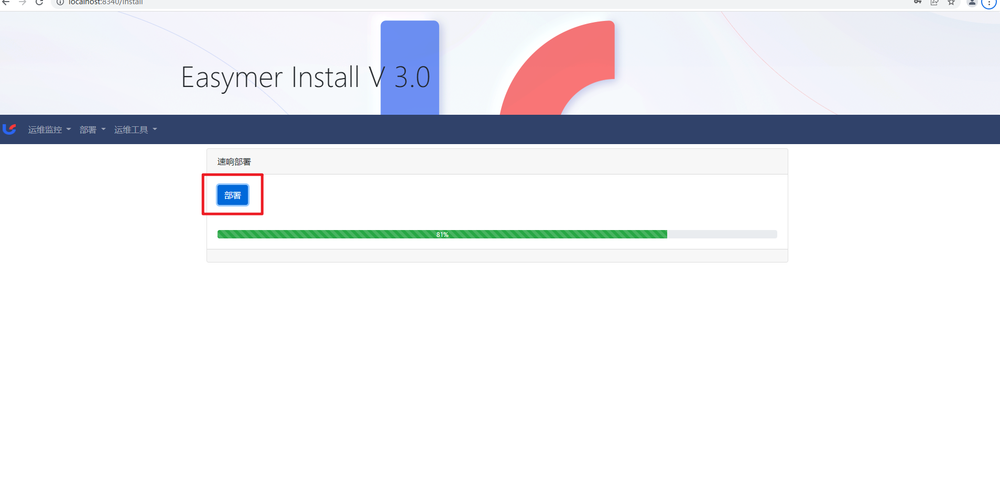

# 页面部署
> 通过页面系统进行速响easymer部署

## 解压部署包

执行解压auto-install.tar.gz  
`tar -zxvf auto-install.tar.gz -C /data`  
解压成功之后进入auto-install文件夹 

## 安装JDK8

执行`sh startup.sh jdk8`安装JDK8  
 
 
## 启动程序
到auto-install目录下启动执行`sh startup.sh start`，可以使用`sh startup.sh log`查看日志。  
 
 
 
## 访问部署程序

1.浏览器访问`http://ip:8340`，进入登录页，默认账号密码 `admin/meiya@20pico`  
   
2.前往部署，点击部署按钮等待部署  
 
 
!>若部署过程中出现问题，则可以查看部署容器的日志`sh startup.sh log`，会有部署命令输出，可以根据命令显示查看部署脚本进行相关信息的修改以及维护。

## 验证是否成功

等待2分钟访问8600/nacos登陆进行服务查看是否有服务注册。若nacos访问不了，可以详见4.2进行处理。若在nacos看到2页服务，则可以前往8660/galax门户进行登录，若登录失败，可以详见4.4进行处理。
