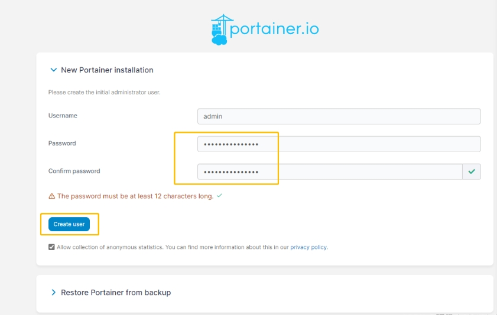
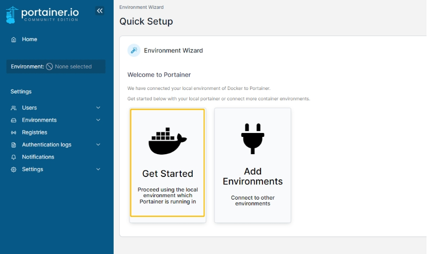
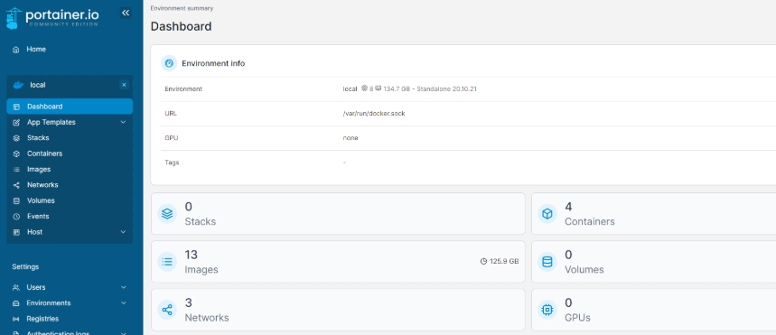

# PORTAINER DOCKER 运维
> 提供页面化docker 容器运维工具

部署成功之后可以在服务器命令行中执行`docker ps -a`，查看是否存在`galaxy-portainer`容器名的docker服务，若没有启动则可以执行`docker start galaxy-portainer`进行启动。
启动成功之后，可以在浏览器中输入`http://ip:18050`进入运维容器系统，第一次访问需要先注册用户，统一使用`admin/meiya@20pico`进行注册登录

 
 
 第一次会弹出安装界面，配置账号密码、选择是本地Docker还是远程Docker，一般我们选择本地Docker，也就是local，可以查看宿主机配置信息、查看容器、镜像、网络、卷等相关信息。
 
 
 
 点击左边的条目，就可以看到我们远程服务器或本地docker容器的可视化界面啦
 
  