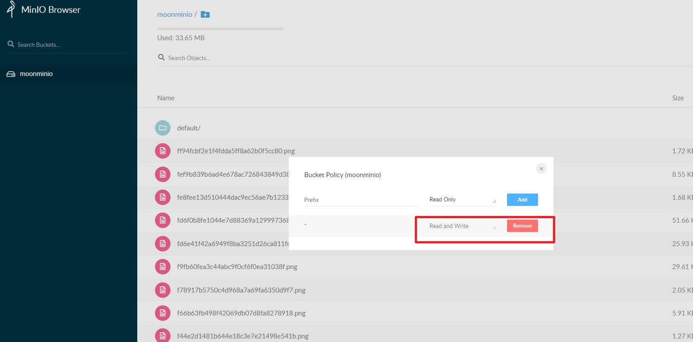
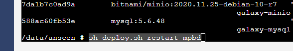
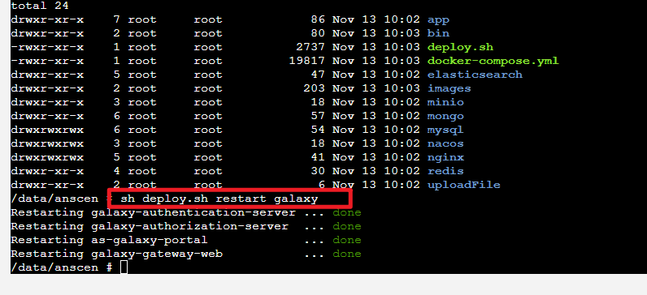

# 问题处理

## 图片无法访问
!>若遇到图片无法访问，前往minio地址修改moonminio桶修改权限位read and write若遇到图片无法访问，前往minio地址修改moonminio桶修改权限位`read and write`

---

## nacos无法启动
!>遇到nacos无法启动，前往anscen目录下执行`sh deploy.sh restart nacos`，重启nacos。

---

## 鹊桥启动失败
!>遇到mpbd没有启动成功，则前往anscen目录下执行sh deploy.sh restart mpbd，重启鹊桥。

---

## 门户登录失败
!>若门户登陆失败，则前往anscen目录下执行sh deploy.sh restart galaxy，重启门户。

---
